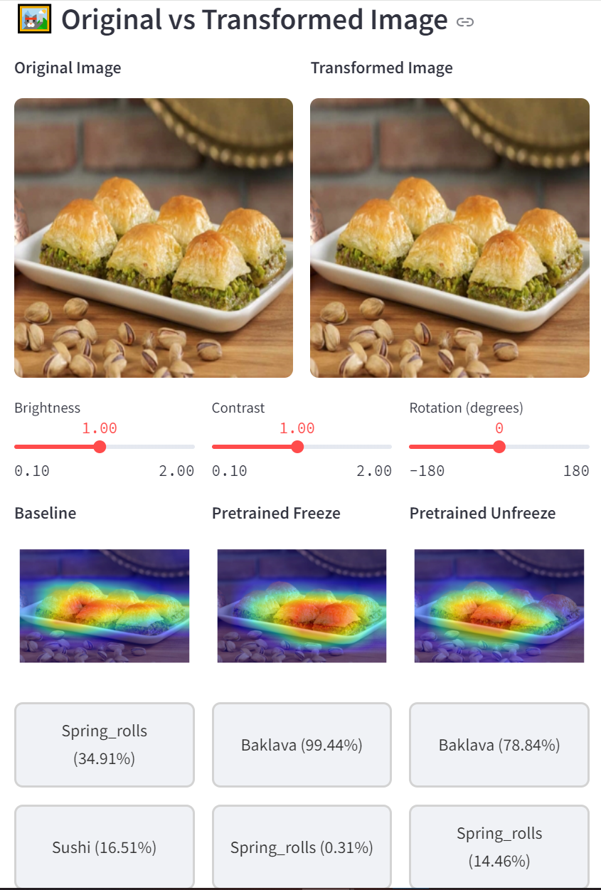
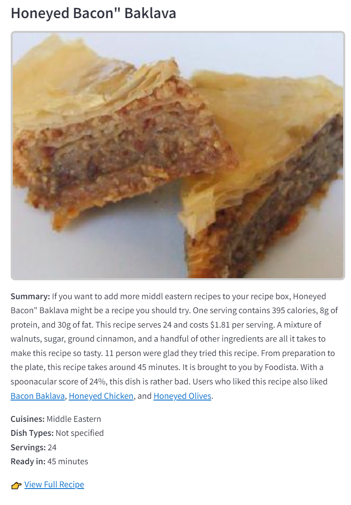

# 🍽️ Food-101 Web App 

An interactive Streamlit application for visualizing **Food-101** image classification models with Grad-CAM explanations and recipe recommendations.

👉 **[Check the Live Web App](https://food-101-web-dl.streamlit.app/)**

---

# System Design

To make the project accessible to users and simulate a real-world application, I divided the project into two parts:

---

## 1. Training Application
The run file is located in the 'generate_model' folder. Since it's an .ipynb notebook, run it step by step to generate the models.

### Summary

The training application focuses on building, training, and evaluating deep learning models using the **Food-101 dataset**.

- Models Used:
  - **Baseline CNN (ResNet18 from scratch)**
  - **Pretrained ResNet18 (Frozen layers)**
  - **Pretrained ResNet18 (Unfrozen all layers for fine-tuning)**

- Training Process:
  - Dataset split: Train / Validation / Test
  - Data augmentation: Rotation, horizontal flip, normalization
  - Hyperparameter tuning: Learning rate adjustments, batch size variations
  - Early stopping and checkpoint saving to optimize training
  - Visual training history: Accuracy and loss plots
  - Best model saved and exported for deployment

- Output:
  - Trained model checkpoint (`.pth` file)
  - Evaluation metrics (Accuracy, Classification Report, Confusion Matrix)
  - Training history and performance graphs
 
### Installation (Training App)
Just download train.ipynb, open it, and run the notebook cells step by step.
The application will automatically:
- Download the Food-101 dataset
- Create all necessary folders and files for models and outputs
- Start the training process and save the best model checkpoint

```
python -m venv venv-train
source venv-train/bin/activate  # On Windows: venv-train\Scripts\activate
pip install -r requirements.txt
```
    
## 2. Deployment Application (Web App)

### Features

- Three model comparisons: Baseline, Pretrained Freeze, Pretrained Unfreeze
- Image transformation sliders (brightness, contrast, rotation)
- Grad-CAM visualizations for model interpretability
- Recipe recommendations based on predictions
- Fast and clean UI, optimized for performance

### Image


<br>



### Installation Web

```bash
git clone https://github.com/akw-waked/Food-101-Web
cd food-101-web
python -m venv venv-web
source venv-web/bin/activate  # On Windows: venv-web\Scripts\activate
pip install -r requirements.txt
streamlit run app.py
